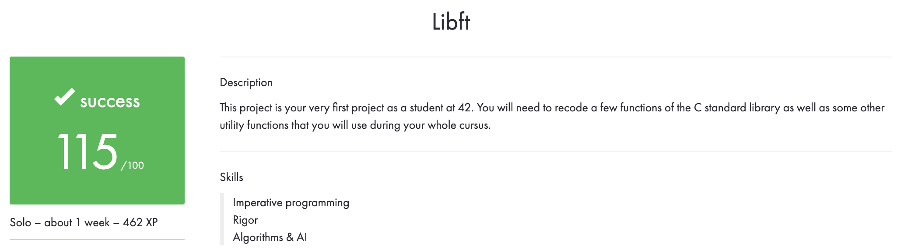

42Madrid Cursus - LIBFT

Libreria propia que usaremos durante todo el curso 42.

## Uso

Usaremos "Makefile"

**make** //
Compila las funciones basicas de libft

**make fclean** //
Limpia "*.o" y libreria

**Para la parte bonus:**

Algunas funciones de estructuras.

**make bonus** //
Compila las funciones basicas de libft + bonus (funciones de estructuras)
